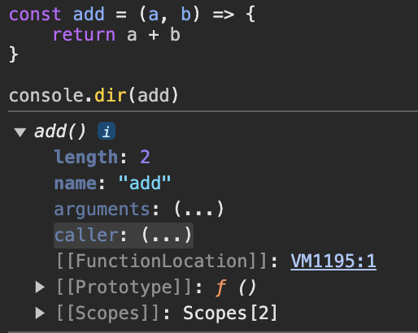
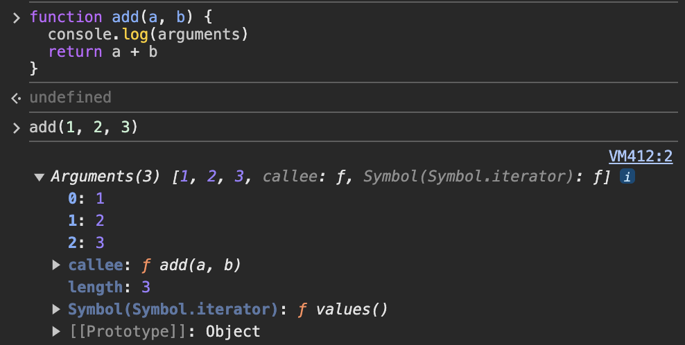
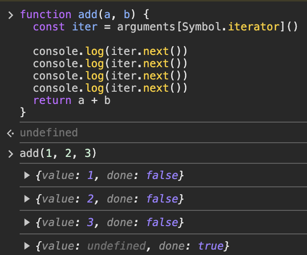

## 18장. 함수와 일급 객체
### 18.1 일급 객체
> 다음과 같은 조건을 만족하는 객체를 __일급 객체__ 라 한다.

1. 무명의 리터럴로 생성할 수 있다. 즉, 런타임에 생성이 가능하다
2. 변수나 자료구조 (객체, 배열 등)에 저장할 수 있다.
3. 함수의 매개변수에 전달할 수 있다.
4. 함수의 반환값으로 사용할 수 있다.

> 저번 12장 __함수__ 부분에서 함수는 __일급 객체__ 라고 했다.

``` javascript
// 1. 무명의 리터럴로 생성할 수 있으며, 2. 변수나 자료구조에 저장할 수 있다.
// 1. 무명의 리터럴로 생성할 수 있으며, 2. 변수나 자료구조에 저장할 수 있다.
const increase = function (num) {
  return ++num;
}

const obj = { increase }

// 3. 함수의 매개변수에 전달할 수 있다.

function doSomething(x, func) {
  return func(x)
}

let x = 30
console.log(doSomething(x, increase)) // 31

// 4. 함수의 반환값으로 사용할 수 있다

function returnHelloWorld() {
  const helloWorld = () => {
    console.log('hello world')
  }

  return helloWorld
}
const func = returnHelloWorld()
func() // hello world
```

-> 함수가 일급 객체라는 것을 알 수 있음
  - 객체 = 값
  - 함수 = 객체 = 값
  - 즉, 값이 필요한 곳에 함수가 들어갈 수 있다.
  
=> 함수형 프로그래밍을 가능하게 함.

||함수|일반 객체|
|--|--|--|
|호출 여부|O|X|
|고유 프로퍼티 여부|O|X|

### 18.2 함수 객체의 프로퍼티





> arguments, caller, length, name, prototype 프로퍼티는 모두 함수 객체의 데이터 프로퍼티

#### 18.2.1 arguments 프로퍼티
함수 호출 시 전달된 인수들의 정보를 담고 있는 순호 가능한 __유사 배열 객체__ arguments 객체를 프로퍼티 값으로 가지고 있음.

> 함수 내 지역 변수처럼 사용되기 때문에 외부에서 접근할 수 없다.



arguments 객체는
- callee
- length
- Symbol(Symbol.iterator)

프로퍼티를 가지고 있다.

- callee : 객체를 생성한 함수를 가리킴
- length : 인자들의 길이
- Symbol(Symbol.iterator) : 객체를 순회 가능한 iterable로 만듥 위한 프로퍼티

```javascript
function add(a, b) {
  const iter = arguments[Symbol.iterator]()

  console.log(iter.next())
  console.log(iter.next())
  console.log(iter.next())
  console.log(iter.next())
  return a + b
}
```



arguments는 __유사 배열 객체__ 이므로 배열의 메서드를 사용할 수 없고, 순회만 할 수 있다. (for로도 가능)

#### 18.2.2 caller 프로퍼티
함수 자신을 호출한 함수를 가리키는 프로퍼티

> 중요하지 않은 프로퍼티 건너뛰어도 됨

#### 18.2.3 length 프로퍼티
함수를 정의할 때 선언한 매개변수의 개수를 가리킴

#### 18.2.4 name 프로퍼티
함수 이름을 나타냄

#### 18.2.5 __ proto __ 접근자 프로퍼티
`[[Prototype]]` 내부 슬롯이 가리키는 프로토타입 객체에 접근하기 위해 사용하는 접근자 프로퍼티

> `[[Prototype]]` 객체에 직접 접근할 수는 없으며 `__proto__`를 통해 간접적으로 접근할 수 있다.

#### 18.2.6 prototype 프로퍼티
```javascript
console.log((function() {}).hasOwnProperty('prototype')) // true
console.log({}.hasOwnProperty('prototype')) // false
```